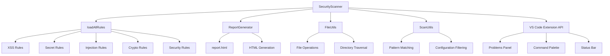
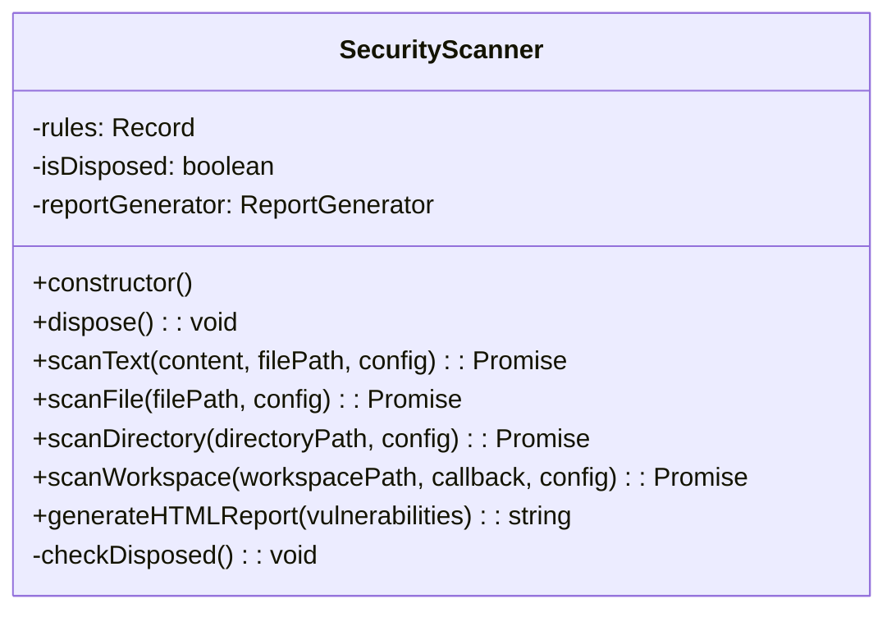
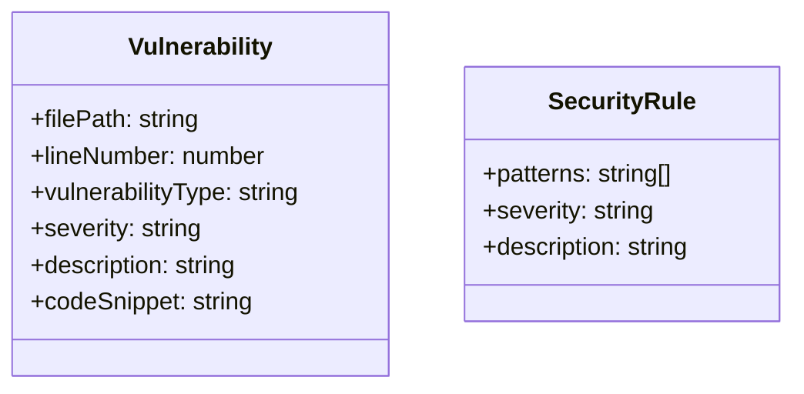
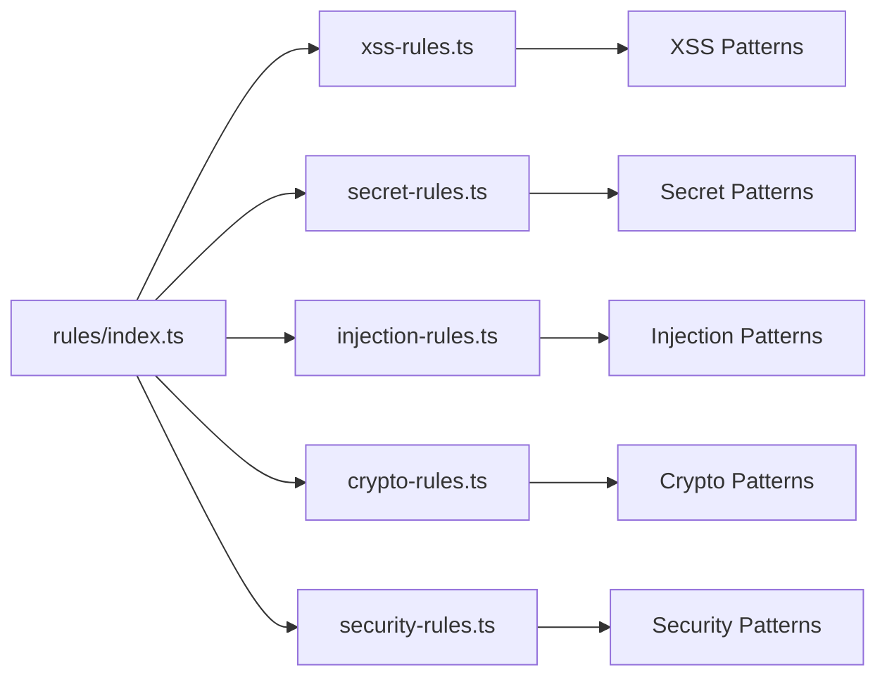
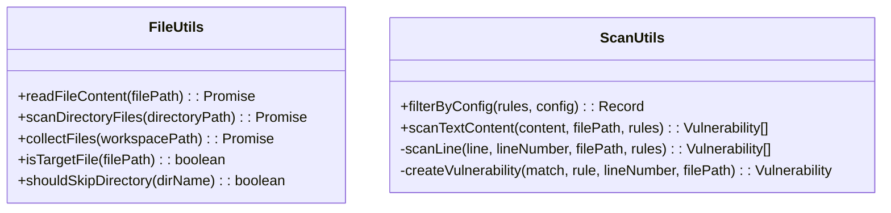
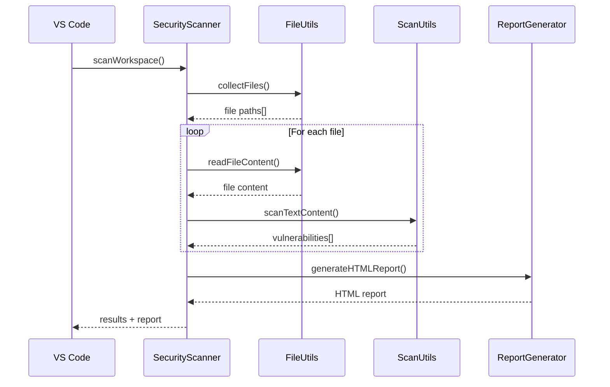
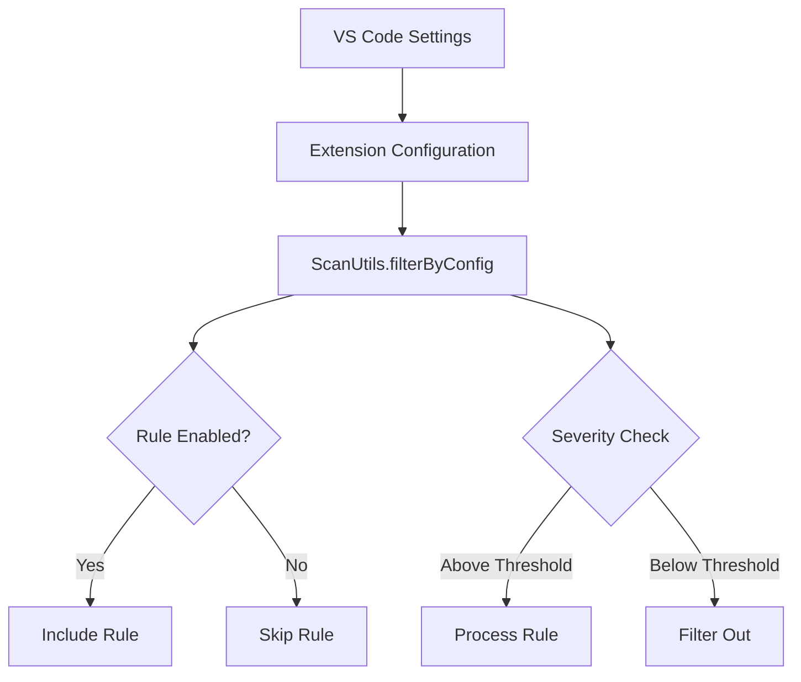
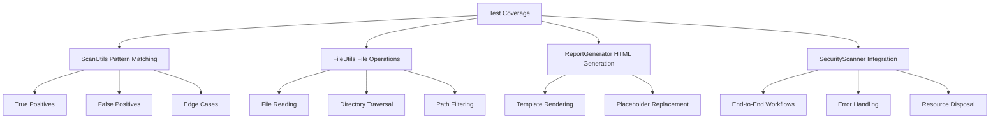

# 🏗️ CodeWolf Security Scanner - Architecture Documentation

## 📋 Overview

The CodeWolf Security Scanner follows a **modular architecture** with clean separation of concerns. After a major refactoring (v1.0.13), the codebase was reduced by 91% while maintaining all functionality through strategic modularization.

## 🎯 Design Principles

- **Single Responsibility Principle**: Each module has one focused purpose
- **Dependency Injection**: Components are loosely coupled and easily testable
- **Resource Management**: Proper disposal patterns prevent memory leaks
- **Extensibility**: Easy to add new rules, templates, and utilities

---

## 🏛️ System Architecture



---

## 📁 Module Structure

### **Core Scanner (`src/scanner.ts`)**


### **Interfaces (`src/interfaces/`)**


### **Rules System (`src/rules/`)**


### **Utilities (`src/utils/`)**


### **Report Generation (`src/templates/`)**
```mermaid
graph TD
    A[ReportGenerator] --> B[report.html]
    A --> C[generateHTMLReport]
    C --> D[Replace Placeholders]
    D --> E[{{VULNERABILITIES}}]
    D --> F[{{TOTAL_COUNT}}]
    D --> G[{{SCAN_DATE}}]
    D --> H[{{CRITICAL_COUNT}}]
```

---

## 🔄 Data Flow



---

## 🎛️ Configuration Flow



---

## 🔧 Extension Points

### **Adding New Rules**
1. Create new rule file in `src/rules/`
2. Export rule object with patterns, severity, description
3. Import and add to `loadAllRules()` in `src/rules/index.ts`

### **Adding New Utilities**
1. Create new utility class in `src/utils/`
2. Follow static method pattern for reusability
3. Import in main scanner and use

### **Customizing Reports**
1. Modify `src/templates/report.html` for styling
2. Add new placeholders in `ReportGenerator.generateHTMLReport()`
3. Extend vulnerability data structure if needed

---

## 📊 Performance Characteristics

### **Before Refactoring (v1.0.8)**
- **File Size**: ~34KB
- **Lines of Code**: 835 lines
- **Structure**: Monolithic single file
- **Maintainability**: Difficult to extend

### **After Refactoring (v1.0.13)**
- **File Size**: ~3KB (main scanner)
- **Lines of Code**: 78 lines (main scanner)
- **Structure**: 15+ modular files
- **Maintainability**: Easy to extend and test

### **Performance Improvements**
- **91% code reduction** in main scanner
- **Faster compilation** due to smaller files
- **Better memory management** with disposal patterns
- **Improved extensibility** for future features

---

## 🧪 Testing Strategy

### **Unit Testing Targets**


---

## 🚀 Future Enhancements

### **Phase 1: Core Improvements**
- Async file operations (`fs.promises`)
- Enhanced regex patterns
- Multiline vulnerability detection

### **Phase 2: Advanced Features**
- External rule configuration (JSON/YAML)
- Custom report themes
- Performance benchmarking

### **Phase 3: Enterprise Features**
- AST-based analysis
- CI/CD integration
- Team collaboration features

---

## 🏆 Architectural Achievements

✅ **91% Code Reduction** - From 835 to 78 lines  
✅ **Modular Design** - 15+ focused files  
✅ **Clean Separation** - Single responsibility per module  
✅ **Resource Management** - Proper disposal patterns  
✅ **Extensibility** - Easy to add new features  
✅ **Maintainability** - Clear, readable codebase  
✅ **Performance** - Faster compilation and execution  

---

*🐺 "Clean architecture is not written by following a set of rules. Clean architecture is written by "Vibe-Coders" who care."*

**Built with ❤️ for the Developer Community**
